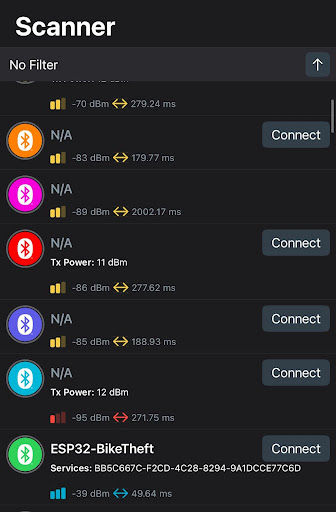

# Kenny Kim (kk67) Worklog
---

### Table of Contents

- [02-04-2025 - Project Proposal Research](#02-04-2025---project-proposal-research)
- [02-05-2025 - Project Proposal cont.](#02-05-2025---project-proposal-cont)
- [02-11-2025 - Prerequisites](#02-11-2025---prerequisites)
- [02-14-2025 - App](#02-14-2025---app)
- [02-20-2025 - Ordering Parts](#02-20-2025---ordering-parts)
- [02-25-2025 - What is BLE?](#02-25-2025---what-is-ble)
- [03-07-2025 - BLE server code setup](#03-07-2025---ble-server-code-setup)
- [03-18-2025 - Mobile App Integration](#03-18-2025---mobile-app-integration)
- [03-27-2025 - ESP-NOW progress](#03-27-2025---esp-now-progress)
- [03-28-2025 - ESP-NOW to BLE to App](#03-28-2025---esp-now-to-ble-to-app)
- [03-31-2025 - Latency Test](#03-31-2025---latency-test)
- [04-10-2025 - Combining sensors and ESP-NOW](#04-10-2025---combining-sensors-and-esp-now)
- [04-18-2025 - Displaying sensor data](#04-18-2025---displaying-sensor-data)
- [04-22-2025 - Full system test](#04-22-2025---full-system-test)
- [04-27-2025 - Adding notifications and smoothing](#04-27-2025---adding-notifications-and-smoothing)
- [05-01-2025 - Range testing](#05-01-2025---range-testing)

### 02-04-2025 - Project Proposal Research
Looked into options for how we can send efficiently transfer the sensor data on the main module to a mobile application. First we considered Bluetooth, but that would cause some problems as Bluetooth range is very short, typically around 32 feet. This is not ideal, as the bike rack can be very far from your classroom and lose connection quickly. We considered WiFi and sending data to a cloud server using a connection from IllinoisNet, but that would be impractical for off campus situations. Found ESPNOW which enables connections up to 220 meters, is connectionless, and low latency, which is exactly what we need for the project. 

### 02-05-2025 - Project Proposal cont.
Added a receiver module ESP32 that will receive ESPNOW packets from the main module and connect to your phone via Bluetooth, enabling data flow between the bike lock and your phone. 
### 02-11-2025 - Prerequisites
Started reading the [Swift Documentation](https://docs.swift.org/swift-book/documentation/the-swift-programming-language/guidedtour/) to brush up on syntax and overall app workflow as it has been a while since I last made a mobile application. Also began looking into how [ESPNOW](https://docs.espressif.com/projects/esp-idf/en/stable/esp32/api-reference/network/esp_now.html) works and what is needed in Arduino. 
### 02-14-2025 - App 
Initial setup of the Swift mobile app project. Referred to the [CoreBluetooth](https://developer.apple.com/documentation/corebluetooth) framework for BLE setup. This is a native library to iOS maintained by Apple so I thought this would be the best choice for BLE integration with the ESP32, as opposed to other frameworks such as Bluejay because of the more detailed documentation and examples to work off of, given my lack of familiarity with the libraries. Set up a very basic app and tried to compile on my phone. Because I got a new phone, I had to change my iOS settings to developer mode and change my privacy settings to allow XCode to download the app directly to my phone. 

### 02-20-2025 - Ordering Parts
Finished up the proposal review and talked with Professor Oelze about some suggestions for the mobile app. He told me that I should add battery monitoring for both the main module and receiver module as well as sending notifications when the battery is below a certain percentage. I haven't even considered this, but it definitely improves the user experience, as you can tell when you need to charge each battery and can know what your battery is currently at. Also ordered some ESP32S DevKits for testing the data pipeline. 

### 02-25-2025 - What is BLE?
Started working on setting up the BLE connection using the ESP32 Dev board. Needed to learn some background context, since this is my first time working with Bluetooth devices. From [RandomNerdTutorials](https://randomnerdtutorials.com/esp32-ble-server-client/), I learned how BLE works as a protocol with ESP32. The General Attribute Profile (GATT) defines the way the data is organized and exchanged between devices. It creates a hierarchy as shown below, with services and characterstics. For this instance, we will need all the sensor data and such sent via ESP-NOW formed into a service, and the characterstics set to read and notify. Setting up the ESP32 as the BLE server, this will allow the client (iOS app) to read the sensor values and have the server send updates to the client when the value is changed. Could add write features in the future, but I want to focus on getting the data flow working before worrying about having the mobile app write data to the lock. We will need a unique Characteristic and Service UUID, I found this [website](https://guidgenerator.com/) that lets us generate UUIDs in industry format, so I used those to get 
```swift
let serviceUUID = CBUUID(string: "bb5c667c-f2cd-4c28-8294-9a1dcce77c6d")
let characteristicUUID = CBUUID(string: "f53c7d59-eca1-45b0-9b4d-b362036fec96")
```

Nothing has gone wrong so far, will begin working on the actual Arduino code and debugging, but I have to finish up the Design Document first. 

### 03-07-2025 - BLE server code setup
Today, the goal was to set up the BLE server code on one of the ESP32 developer boards and test to see that it connects properly to my phone. The code is below
```cpp
#include <BLEDevice.h>
#include <BLEServer.h>
#include <BLEUtils.h>
#include <BLE2902.h>
#include <esp_now.h>
#include <WiFi.h>

// UUIDs for service and characteristic
#define SERVICE_UUID        "bb5c667c-f2cd-4c28-8294-9a1dcce77c6d"
#define CHARACTERISTIC_UUID "f53c7d59-eca1-45b0-9b4d-b362036fec96"

BLECharacteristic *pCharacteristic;

void setup() {
 Serial.begin(115200);
 Serial.println("Starting BLE server");

 // Initialize BLE server
 BLEDevice::init("ESP32-BikeTheft"); 
 BLEServer *pServer = BLEDevice::createServer();
 BLEService *pService = pServer->createService(SERVICE_UUID);

 pCharacteristic = pService->createCharacteristic(
                     CHARACTERISTIC_UUID,
                     BLECharacteristic::PROPERTY_READ |
                     BLECharacteristic::PROPERTY_NOTIFY
                   );

 pCharacteristic->addDescriptor(new BLE2902());
 pCharacteristic->setValue("Waiting for sensor data...");
 pService->start();

 BLEAdvertising *pAdvertising = BLEDevice::getAdvertising();
 pAdvertising->addServiceUUID(SERVICE_UUID);
 pAdvertising->start();

 Serial.println("BLE device is now advertising...");

void loop() {
 delay(1000);
}
```
Some issues occured when compiling the Arduino sketch. First, I didn't have the proper libraries installed, but that was a quick fix, had to just install them locally. Then I ran into another compiling error, where the ESP32 device wouldn't upload the code. I had to manual boot the ESP32, where I held BOOT while connecting, tapped the RESET button, and then release BOOT once it began uploading. This put the ESP32 in manual boot and I was able to begin uploading. However, I ran into one final issue, where I ran out of space. It read: 
```
Sketch uses 1498984 bytes (114%) of program storage space. Maximum is 1310720 bytes.
Global variables use 66376 bytes (20%) of dynamic memory, leaving 261304 bytes for local variables. Maximum is 327680 bytes.
Sketch too big; see https://support.arduino.cc/hc/en-us/articles/360013825179 for tips on reducing it.
text section exceeds available space in board

Compilation error: text section exceeds available space in board
```
This error was fixed by changing the partition scheme from Default 4MB with spiffs (1.2MB APP/1.5MB SPIFFS) to No OTA (2MB APP/2MB SPIFFS) which freed up some available storage and allowed the upload to finally happen. Then to check if the server was actually running, I had to install the nRFConnect app to scan for BLE devices. 

When scanning for BLE devices, "ESP32-BikeTheft" shows up with the correct UUIDs, and it allows us to connect, verifying that the BLE server is running properly. It took a while to compile and get it running, but at least it is working properly. Will begin working on mobile app and helping with the breadboard demo. 

### 03-18-2025 - Mobile App Integration
Today, the goal is to connect the mobile device to the BLE server that we have established and get that part of the dataflow complete. Set up the BLEManager class as follows: 
```swift
import Foundation
import CoreBluetooth
class BLEManager: NSObject, ObservableObject, CBCentralManagerDelegate, CBPeripheralDelegate {
    private var centralManager: CBCentralManager!
    private var espPeripheral: CBPeripheral?
    private var sensorCharacteristic: CBCharacteristic?
    let serviceUUID = CBUUID(string: "4fafc201-1fb5-459e-8fcc-c5c9c331914b")
    let characteristicUUID = CBUUID(string: "beb5483e-36e1-4688-b7f5-ea07361b26a8")
    @Published var isConnected = false
    @Published var sensorData: String = "Waiting for data..."
    override init() {
        super.init()
        centralManager = CBCentralManager(delegate: self, queue: nil)
    }
    func centralManagerDidUpdateState(_ central: CBCentralManager) {
        // Checks to see if bluetooth is on
        switch central.state {
        case .poweredOn:
            print("Bluetooth is powered on")
            centralManager.scanForPeripherals(withServices: [serviceUUID], options: nil)
        default:
            print("Bluetooth is not powered on")
        }
    }
    func centralManager(_ central: CBCentralManager, didDiscover peripheral: CBPeripheral,
                        advertisementData: [String : Any], rssi RSSI: NSNumber) {
        print("Discovered \(peripheral.name ?? "Unknown")")
        // Sets espPeripheral to connected esp32 and connect to the device
        if peripheral.name?.contains("ESP32") == true {
            espPeripheral = peripheral
            espPeripheral?.delegate = self
            centralManager.stopScan()
            centralManager.connect(peripheral)
        }
    }
    func centralManager(_ central: CBCentralManager, didConnect peripheral: CBPeripheral) {
        print("Connected to ESP32!")
        isConnected = true
        peripheral.discoverServices([serviceUUID])
    }
    func peripheral(_ peripheral: CBPeripheral, didDiscoverServices error: Error?) {
        for service in peripheral.services ?? [] {
            peripheral.discoverCharacteristics([characteristicUUID], for: service)
        }
    }
    func peripheral(_ peripheral: CBPeripheral, didDiscoverCharacteristicsFor service: CBService, error: Error?) {
        for characteristic in service.characteristics ?? [] {
            if characteristic.uuid == characteristicUUID {
                sensorCharacteristic = characteristic
                peripheral.readValue(for: characteristic)
                peripheral.setNotifyValue(true, for: characteristic)
            }
        }
    }
    func peripheral(_ peripheral: CBPeripheral, didUpdateValueFor characteristic: CBCharacteristic, error: Error?) {
        if characteristic.uuid == characteristicUUID, let value = characteristic.value {
            if let stringValue = String(data: value, encoding: .utf8) {
                DispatchQueue.main.async {
                    self.sensorData = stringValue
                    print("Sensor Data: \(stringValue)")
                }
            }
        }
    }
```
I defined a centralManager that handles the scanning and connecting of BLE devices using the Characteristic and Service UUIDs generated for the BLE server. The espPeripheral stores the discovered BLE server peripheral. The sensorCharacteristic stores the specific GATT characteristic used to receive data. I also set up the SwiftUI file to display whether the device is connected to the BLE server using the boolean isConnected, as well as displaying the variable sensorData. sensorData displays `Waiting for data...` when the device is not connected, and updates to the sensorData of the BLE server once it does. I had no sensor data yet since ESP-NOW is not set up, so I sent fake data in the form of a string called "Hello from ESP32". Tried using the XCode iPhone simulation, but simulations cannot connect to BLE so I had to upload the code to my phone directly. However, when compiling, the app crashed. 

After looking into it, especially this [stackoverflow post](https://stackoverflow.com/questions/67896404/where-is-info-plist-in-xcode-13-missing-not-inside-project-navigator), this occurs because we don't have the correct properties allowed for the application and we need to enable Bluetooth. Fixed this by going into the Info.plist file and adding a NSBluetoothAlwaysUsageDescription. Attached are now the two images of the device working properly. 
 
It now asks for Bluetooth permissions as shown on the left, and connects properly to the BLE device and displays the fake data we sent. I checked this further by looking at the serial monitor and checking the print statements, printing `Bluetooth is powered on` and the sensor characteristics and checked if they lined up correctly. From the UI it is clear that the BLE server is working properly with the app and half of the data pipeline is complete! Let's go. This was the main goal to finish over spring break so I will probably spend the rest of the time enjoying my break and begin working on ESP-NOW once I'm back on campus, as I forgot the second ESP32 on my desk. 

### 03-27-2025 ESP-NOW progress
Today, the goal is to establish an ESP-NOW connection between two ESP32s and test that the correct data is being sent. Like with the BLE server, I began looking at [RandomNerdTutorials](https://randomnerdtutorials.com/esp-now-esp32-arduino-ide/). The goal is to establish a one-way connection as shown below: 
 From what I've gathered, there are three main steps to setting up ESP-NOW which are 
1) Initialize ESP-NOW on the dev boards
2) Register callback functions which are executed when we send data on the sender ESP32, and when we receive data on the receiver ESP32
3) Learn the receiver MAC address of the receiver ESP32. 

How ESP-NOW works is that it sends a broadcast message with a labeled MAC address. On the receiver end, if the MAC address lines up with the labeled one, then it will call the callback function and receive the data payload. First, I collected the MAC address of the BLE server ESP32, using the following code: 
```cpp
#include <WiFi.h>
#include <esp_wifi.h>

void readMacAddress() {
  uint8_t baseMac[6];
  esp_err_t ret = esp_wifi_get_mac(WIFI_IF_STA, baseMac);
  if (ret == ESP_OK) {
    Serial.printf("%02x:%02x:%02x:%02x:%02x:%02x\n",
                  baseMac[0], baseMac[1], baseMac[2],
                  baseMac[3], baseMac[4], baseMac[5]);
  } else {
    Serial.println("Failed to read MAC address");
  }
}

void setup() {
  Serial.begin(115200);

  WiFi.mode(WIFI_STA);
  WiFi.STA.begin();

  Serial.print("[DEFAULT] ESP32 Board MAC Address: ");
  readMacAddress();
}

void loop() {
}
```
Running this on the ESP32, we were able to print the MAC address on the serial monitor `a0:85:e3:e6:90:f0`. From this I was able to write the sender code as follows: 
```cpp
#include <esp_now.h>
#include <WiFi.h>

uint8_t bleServerAddress[] = {0xA0, 0x85, 0xE3, 0xE6, 0x90, 0xF0};

// TODO: customize struct with data needed for the sensors
typedef struct sensor_data {
  char data[50];
} sensor_data;

// this will be our outgoing sensor data for the BLE server ESP32
sensor_data outgoingData; 

void setup() {
  Serial.begin(115200);
  WiFi.mode(WIFI_STA);

  if (esp_now_init() != ESP_OK) {
    Serial.println("ESP-NOW init failed");
    return;
  }

  esp_now_peer_info_t peerInfo = {};
  memcpy(peerInfo.peer_addr, bleServerAddress, 6);
  peerInfo.channel = 0;  
  peerInfo.encrypt = false;

  if (!esp_now_add_peer(&peerInfo)) {
    Serial.println("Peer added");
  }

  Serial.println("ESP-NOW sender ready");
}

void loop() {
  String fakeSensor = "testing"; 
  fakeSensor.toCharArray(outgoingData.data, 50);

  esp_err_t result = esp_now_send(bleServerAddress, (uint8_t *) &outgoingData, sizeof(outgoingData));
  if (result == ESP_OK) {
    Serial.println("Sent data: " + fakeSensor);
  } else {
    Serial.println("Send FAILED");
  }

  delay(1000);
}
```
This puts the microcontroller in WiFi Stationary mode, and initializes ESP-NOW on the device. It then begins looking for the MAC address that we just found and begins sending the string `testing`. On the BLE server code we had to add the following functions: 
```cpp
// TODO: customize struct with data needed for the sensors
typedef struct sensor_data {
 char data[50];
} sensor_data;

// data received from the sender ESP32
sensor_data incomingData;

void handleSensorData(const esp_now_recv_info_t *info, const uint8_t *incomingDataBytes, int length) {
 memcpy(&incomingData, incomingDataBytes, sizeof(incomingData));

 char macStr[18];
 snprintf(macStr, sizeof(macStr), "%02X:%02X:%02X:%02X:%02X:%02X",
          info->src_addr[0], info->src_addr[1], info->src_addr[2],
          info->src_addr[3], info->src_addr[4], info->src_addr[5]);
 Serial.print("Received data via ESP-NOW from ");
 Serial.println(macStr);

 Serial.println(incomingData.data);

 // update and notify BLE characteristic
 pCharacteristic->setValue(incomingData.data);
 pCharacteristic->notify();
}

// THIS PART BELOW IS ADDED IN THE setup() function
// Initialize ESP-NOW protocol
 WiFi.mode(WIFI_STA);
 if (esp_now_init() != ESP_OK) {
   Serial.println("Error initializing ESP-NOW");
   return;
 }

 esp_now_register_recv_cb(handleSensorData);
 Serial.println("ESP-NOW initialized");
}
```
This adds a struct for the incoming data, which we will have to change later for real sensor data. It adds initialization of ESP-NOW in the setup code as well as adding a callback function `handleSensorData()` that manages received data. Honestly, this went a lot smoother than I expected. The ESP-NOW initialization went according to plan and when verifying using the serial monitor we were able to see `testing`, which is exactly what we were expecting. This means that ESP-NOW is working properly between two ESP-32 devices. 

### 03-28-2025 ESP-NOW to BLE to App
Quick update, sent in several packets labled `testing` from the sender ESP32 to the receiver BLE server, which should update the characteristics accordingly and display in the mobile application. 

The data pipeline is now working as expected and will just need to be integrated into the main PCB and receiver module using real sensor data. Also I made this block diagram for the IPR to make the data pipeline more clear. 


### 03-31-2025 Latency Test
Ran a latency test on the data sent. Timestamped the data from the sender ESP32 to the BLE server by using the `millis()` function. Then, once the data is received in the mobile app, they are immediately timestamped using the `Date()` function. I wrote a python function 
```python
import serial
import time

PORT = "/dev/ttyUSB0"  
BAUD = 115200

def main():
    ser = serial.Serial(PORT, BAUD, timeout=1)
    print(f"Connected to {PORT} at {BAUD} baud.")
    
    with open(LOG_FILE, "w") as f:
        f.write("PC_Received_Timestamp,ESP_Timestamp,Message\n")
        
        while True:
            line = ser.readline().decode('utf-8').strip()
            if line:
                pc_time = time.time()
                print(f"[{pc_time:.3f}] {line}")
                if "ESP_TIME:" in line:
                    try:
                        esp_time = int(line.split("ESP_TIME:")[1].strip())
                    except:
                        esp_time = ""
                else:
                    esp_time = ""
                f.write(f"{pc_time:.3f},{esp_time},{line}\n")
                f.flush()
```
This parses the serial monitor and checks the latency of the dataflow. I found that it averages around 2 ms for the ESP-NOW which is well below what we wanted. Some issues I had was accessing the correct serial monitor, so I had to run the code in sudo, as well as using the proper PORT name, but both were easy fixes. 

### 04-10-2025 Combining sensors and ESP-NOW
Learned that we will need 3 boolean flags and two floats for the overall sensor data. We will need flags for the vibration sensors, Hall-effect sensors, and whether the lock is engaged or disengaged. We will also need 2 floats for the battery percentage of each PCB microcontroller. Combined the code that Diego and David has finished with the ESP32 code that I have finished to get the following main PCB code: 
```cpp
#include <SPI.h>
#include <MFRC522.h>
#include <esp_now.h>
#include <WiFi.h>

// --- Motor A control pins ---
int motor1Pin1 = 38;
int motor1Pin2 = 39;
int enable1Pin = 40;

// --- Encoder ---
int encoderA = 41;
int encoderB = 42;
volatile int encoderPos = 0;
bool isLocked = false;
const int lockDistance = 3000;

// --- RFID ---
#define SS_PIN 10
#define RST_PIN 14
MFRC522 rfid(SS_PIN, RST_PIN);
byte authorizedUID[4] = {0xB1, 0x89, 0x09, 0x7C};  // Replace with your UID

// --- Sensors ---
const int vibrationSensorPin = 6;
const int tamperHallPin = 4;
const int lockStatusHallPin = 5;

// --- Battery Monitoring ---
const int adcPin = 8;
const float R1 = 100000.0;
const float R2 = 27400.0;
const float voltageDividerRatio = R2 / (R1 + R2);
const float adcMax = 4095.0;
const float refVoltage = 3.3;

float batteryVoltageToPercent(float vIn) {
  float minVolts = 11.5;
  float maxVolts = 12.32;
  if (vIn >= maxVolts) return 100.0;
  if (vIn <= minVolts) return 0.0;
  return (vIn - minVolts) / (maxVolts - minVolts) * 100.0;
}

// --- ESP-NOW Receiver MAC Address ---
uint8_t bleReceiverMAC[] = {0xF4, 0x12, 0xFA, 0xEE, 0x3E, 0xF8}; 
// f4:12:fa:ee:3e:f8

// --- ESP-NOW Struct Payload ---
typedef struct __attribute__((packed)) sensor_packet {
  bool vibration;
  bool tamper;
  bool lockDisengaged;
  float batteryPercent;
} sensor_packet;

sensor_packet outgoingData;

// --- Encoder Interrupt ---
void IRAM_ATTR readEncoder() {
  if (digitalRead(encoderA) == digitalRead(encoderB)) {
    encoderPos++;
  } else {
    encoderPos--;
  }
}

void setup() {
  Serial.begin(115200);

  // --- Motor pins ---
  pinMode(motor1Pin1, OUTPUT);
  pinMode(motor1Pin2, OUTPUT);
  pinMode(enable1Pin, OUTPUT);

  // --- Encoder setup ---
  pinMode(encoderA, INPUT);
  pinMode(encoderB, INPUT);
  attachInterrupt(digitalPinToInterrupt(encoderA), readEncoder, CHANGE);

  // --- RFID init ---
  SPI.begin(12, 13, 11, 10); // SCK, MISO, MOSI, SS
  rfid.PCD_Init();
  Serial.println("Scan RFID to Lock/Unlock.");

  // --- Sensor pins ---
  pinMode(vibrationSensorPin, INPUT);
  pinMode(tamperHallPin, INPUT);
  pinMode(lockStatusHallPin, INPUT);

  // --- ADC Setup ---
  analogReadResolution(12);

  // --- ESP-NOW Init ---
  WiFi.mode(WIFI_STA);
  if (esp_now_init() != ESP_OK) {
    Serial.println("ESP-NOW init failed!");
    return;
  }

  esp_now_peer_info_t peerInfo = {};
  memcpy(peerInfo.peer_addr, bleReceiverMAC, 6);
  peerInfo.channel = 0;
  peerInfo.encrypt = false;

  if (!esp_now_add_peer(&peerInfo)) {
    Serial.println("Added BLE server peer.");
  }
}

void loop() {
  readRFID();
  sendSensorData();
  delay(1000);
}

// ---------------------- SENSOR DATA SENDER ----------------------

void sendSensorData() {
  // Populate struct fields
  outgoingData.vibration = digitalRead(vibrationSensorPin);
  outgoingData.tamper = (digitalRead(tamperHallPin) == LOW);
  outgoingData.lockDisengaged = (digitalRead(lockStatusHallPin) == HIGH);

  int adcValue = analogRead(adcPin);
  float vOut = (adcValue / adcMax) * refVoltage;
  float vIn = vOut / voltageDividerRatio;
  outgoingData.batteryPercent = batteryVoltageToPercent(vIn);

  // Send over ESP-NOW
  esp_err_t result = esp_now_send(bleReceiverMAC, (uint8_t*)&outgoingData, sizeof(outgoingData));

  if (result == ESP_OK) {
    Serial.print("Data sent: ");
    Serial.print("VIB: "); Serial.print(outgoingData.vibration);
    Serial.print(" | TAMP: "); Serial.print(outgoingData.tamper);
    Serial.print(" | LOCK: "); Serial.print(outgoingData.lockDisengaged);
    Serial.print(" | BATT: "); Serial.print(outgoingData.batteryPercent, 1);
    Serial.println("%");
  } else {
    Serial.println("ESP-NOW send failed.");
  }
}

// ---------------------- RFID & LOCK ----------------------

void readRFID() {
  if (rfid.PICC_IsNewCardPresent() && rfid.PICC_ReadCardSerial()) {
    if (rfid.uid.uidByte[0] == authorizedUID[0] &&
        rfid.uid.uidByte[1] == authorizedUID[1] &&
        rfid.uid.uidByte[2] == authorizedUID[2] &&
        rfid.uid.uidByte[3] == authorizedUID[3]) {

      Serial.println("Authorized RFID Tag Scanned!");

      if (!isLocked) {
        lock();
      } else {
        unlock();
      }

      isLocked = !isLocked;

    } else {
      Serial.println("Unauthorized RFID Tag!");
    }

    rfid.PICC_HaltA();
    rfid.PCD_StopCrypto1();
  }
}

// ------------------ Motor Control ------------------

void lock() {
  Serial.println("Locking...");
  int targetPosition = encoderPos + lockDistance;

  digitalWrite(motor1Pin1, HIGH);
  digitalWrite(motor1Pin2, LOW);
  digitalWrite(enable1Pin, HIGH);

  while (encoderPos < targetPosition) {
    Serial.print("Locking... Position: ");
    Serial.println(encoderPos);
    delay(10);
  }

  stopMotor();
  Serial.println("Locked.");
}

void unlock() {
  Serial.println("Unlocking...");
  int targetPosition = encoderPos - lockDistance;

  digitalWrite(motor1Pin1, LOW);
  digitalWrite(motor1Pin2, HIGH);
  digitalWrite(enable1Pin, HIGH);

  while (encoderPos > targetPosition) {
    Serial.print("Unlocking... Position: ");
    Serial.println(encoderPos);
    delay(10);
  }

  stopMotor();
  Serial.println("Unlocked.");
}

void stopMotor() {
  digitalWrite(motor1Pin1, LOW);
  digitalWrite(motor1Pin2, LOW);
  digitalWrite(enable1Pin, LOW);
}
```
Had to change the struct and ensure that everything was working properly together. Ran the same MAC address code to get the proper MAC address for our Receiver module. Ran into some space issues, but I ran into this before while setting up the BLE server code so that was a quick fix, by changing the partition scheme. 

### 04-18-2025 Displaying sensor data
Today the goal is to update the UI of the mobile application to display sensor data and battery monitoring. Changed ContextView.swift to: 
```swift
import SwiftUI

struct ContentView: View {
    @ObservedObject var bleManager = BLEManager()

    var body: some View {
        VStack(spacing: 30) {
            Text("Bike Alert")
                .font(.largeTitle)
                .bold()
                .padding(.top)

            // Connection Status
            Text(bleManager.isConnected ? "✅ Connected to ESP32" : "🔄 Scanning for device...")
                .foregroundColor(bleManager.isConnected ? .green : .orange)
                .font(.headline)

            // Sensor Status Overview
            VStack(spacing: 10) {
                HStack {
                    Label("Vibration", systemImage: bleManager.vibrationDetected ? "exclamationmark.triangle.fill" : "checkmark.circle")
                        .foregroundColor(bleManager.vibrationDetected ? .red : .green)
                    Spacer()
                }

                HStack {
                    Label("Tampering", systemImage: bleManager.tamperingDetected ? "exclamationmark.triangle.fill" : "checkmark.circle")
                        .foregroundColor(bleManager.tamperingDetected ? .red : .green)
                    Spacer()
                }

                HStack {
                    Label("Lock", systemImage: bleManager.lockDisengaged ? "lock.open.fill" : "lock.fill")
                        .foregroundColor(bleManager.lockDisengaged ? .red : .green)
                    Spacer()
                }
            }
            .padding()
            .background(Color(.secondarySystemBackground))
            .cornerRadius(12)
            .shadow(radius: 3)

            // Battery Monitor
            VStack(spacing: 10) {
                Text("Battery Level")
                    .font(.headline)

                ProgressView(value: Double(bleManager.batteryLevel), total: 100)
                    .progressViewStyle(LinearProgressViewStyle(tint: .green))
                    .frame(width: 200)
                    .animation(.easeInOut, value: bleManager.batteryLevel)

                Text("\(bleManager.batteryLevel)%")
                    .font(.system(size: 18, weight: .medium, design: .monospaced))
                    .foregroundColor(.blue)
            }

            Spacer()
        }
        .padding()
    }
}
```
We also modified some backend code to parse the sensor data. 
```swift
func peripheral(_ peripheral: CBPeripheral, didUpdateValueFor characteristic: CBCharacteristic, error: Error?) {
        if characteristic.uuid == characteristicUUID,
           let value = characteristic.value,
           let stringValue = String(data: value, encoding: .utf8) {

            DispatchQueue.main.async {
                self.sensorData = stringValue

                // Update individual flags based on substring presence
                self.vibrationDetected = stringValue.contains("VIBRATION")
                self.tamperingDetected = stringValue.contains("TAMPER")
                self.lockDisengaged = stringValue.contains("LOCK DISENGAGED")

                // Extract battery percent
                if let percent = stringValue.components(separatedBy: "Battery:").last?.replacingOccurrences(of: "%", with: "").trimmingCharacters(in: .whitespaces),
                   let batteryInt = Int(Double(percent) ?? 0) {
                    self.batteryLevel = batteryInt
                }

                // Send notification if any alert is active
                if self.vibrationDetected || self.tamperingDetected {
                    self.notifyUser(title: "Bike Theft Alert", body: stringValue)
                }
            }
        }
    }
```
The ESP32s send data via a defined struct in Arduino, but the issue is that we won't be able to read that struct in Swift, as it is not supported, as far as I know. A workaround that I found was by changing nothing in the Main PCB, but updating the BLE characteristics as a string, so that we can simply parse the string in Swift, and update flags accordingly. This mimics a struct without having functionality for structs. The UI looks as follows: 

and should work accordingly. This provides a clean user interface for all the sensors to work and shows the battery percentage, which is exactly what we wanted from our mobile application. I will be meeting with my group later this week to debug and test before the mock and see if everything works with real data. 

### 04-22-2025 Full system test
The goal today is to get everything working together before the mock demo. First we uploaded all the code accordingly and checked with the serial monitor to see if the values were correct. We would move the magnets around to trigger tampering and physically hit the vibration sensor to trigger it as well. Then, we would look at the receiver module, where we would print out the ESP-NOW message received, and look at the values to see if they made any sense. We found that it was working as expected. Furthermore, when we connected my phone to the receiver module, we were able to connect properly and display everything. Everything is working as expected and should be good for the mock demo. 

### 04-27-2025 Adding notifications and smoothing
The dataflow pipeline is complete, so the objective today was to implement some feedback from the mock demo and tweak the UI for the final demo. First, I added notifications to the mobile application by adding two functions: 
```swift
private func requestNotificationPermission() {
    UNUserNotificationCenter.current().requestAuthorization(options: [.alert, .sound, .badge]) { granted, error in
        if granted {
            print("✅ Notification permission granted")
        } else if let error = error {
            print("❌ Notification permission error: \(error.localizedDescription)")
        }
    }
}

private func notifyUser(title: String, body: String) {
    print("🔔 Attempting to send notification -- Title: \(title), Body: \(body)")

    let content = UNMutableNotificationContent()
    content.title = title
    content.body = body
    content.sound = .default

    let request = UNNotificationRequest(identifier: UUID().uuidString, content: content, trigger: nil)
    UNUserNotificationCenter.current().add(request) { error in
        if let error = error {
            print("❌ Notification failed to schedule: \(error.localizedDescription)")
        } else {
            print("✅ Notification scheduled successfully.")
        }
    }
}
```
The first function allows us to ask for notification privileges and the second allows us to send a push notification to the phone whenever we call it. We first tested this by calling the notification function when a vibration is triggered. However, I found that iOS actually tends to hide push notifications especially when they are being sent multiple time in a row. In the terminal, we would see a print message that a notification was triggered, but it would not show up in our mobile device. Took a while to debug, but it is a quirk with iOS and a workaround we added was adding sounds to the banner notifications so that even when they don't show up, you still hear a sound effect. I added regular notification sounds for when either vibration or tampering sensors are triggered and an alarm sound when both are triggered together. I also added haptic feedback for both, as well as notifications for low battery on either device. 
```swift
private func vibratePhone() {
    let generator = UINotificationFeedbackGenerator()
    generator.notificationOccurred(.warning)
}

private func playSound() {
    AudioServicesPlaySystemSound(SystemSoundID(1007))
}

private func playAlarm() {
    AudioServicesPlaySystemSound(SystemSoundID(1005))
}
```
Also added a reset alerts button so that when a user goes to the bike lock and sees that everything is working correctly, that they can reset the flags back to normal. This is simply done by resetting the variables and adding a button in SwiftUI. Finally, I added a smoothing factor on the battery percentage, because we found during testing that the potentiometer value tends to fluctuate so in the UI, there would be rapid jumps from like 87 to 91 and not entirely accurate. I researched different ways that battery monitoring is handled and most use some sort of smoothing factor on the voltage calculations. However, I did not want to reupload code and change anything on a working product, so I decided to add the smoothing factor on the backend of the App, allowing quicker debugging and testing. We used 
```swift
private func extractBatteryValue(from message: String, key: String) -> Int? {
    guard let match = message.components(separatedBy: key).last?
        .components(separatedBy: " ")
        .first?
        .replacingOccurrences(of: "%", with: "")
        .trimmingCharacters(in: .whitespaces),
            let percent = Double(match) else {
        return nil
    }
    return Int(percent)
}
```
to extract the battery values from the data payload, and in the handling of the characteristics, we add 
```swift
// BatterySender
if let senderVal = self.extractBatteryValue(from: stringValue, key: "BatterySender:") {
    self.batterySender = senderVal

    if self.smoothedBatterySender == 0 {
        self.smoothedBatterySender = Double(senderVal) // Initialize immediately
    } else {
        self.smoothedBatterySender = (self.batterySmoothingFactor * Double(senderVal)) +
                                        (1.0 - self.batterySmoothingFactor) * self.smoothedBatterySender
    }
}

// BatteryServer
if let serverVal = self.extractBatteryValue(from: stringValue, key: "BatteryServer:") {
    self.batteryServer = serverVal

    if self.smoothedBatteryServer == 0 {
        self.smoothedBatteryServer = Double(serverVal) // Initialize immediately
    } else {
        self.smoothedBatteryServer = (self.batterySmoothingFactor * Double(serverVal)) +
                                        (1.0 - self.batterySmoothingFactor) * self.smoothedBatteryServer
    }
}
```
which applies an exponential moving average (EMA) filter for later updates of the battery. This is calculated by the EMA formula, $$S_t = \alpha x_t + (1 - \alpha) S_{t-1}$$
where $\alpha$ is the smoothing factor. Doing some testing, we found that the average was starting way lower than expected. On the serial monitor we were getting something like 91% but on the app we were getting something around 30%. The EMA filter messed up our battery display. I found the issue was that we were starting at an initial value of $0\%$, which caused the average to fall much lower than expected. The fix I found was initializing $S_0$ to be the first reading of the battery. So simple but couldn't be found until testing. After some visual testing we set our smoothing factor $\alpha = 0.1$ as anything greater had too much fluctuation. Everything should be ready for the final demo. 

### 05-01-2025 - Range testing 
Today, the goal was to do some functional verification for the Bike Alert system. I wanted to conduct some range tests for the ESP-NOW protocol to check if our system can handle range of up to 200 meters, as we wanted for our final product. This was done by using the Received Signal Strength Indicator (RSSI), which we send via ESP-NOW. 

This diagram explains some decibel ranges of the RSSI and what it indicates in terms of strength. The range tests were conducted using two ESP32 dev boards, one sending constant packets of data using ESP-NOW, we changed nothing about the device, as ESP-NOW automatically sends the RSSI with the data payload. The sender code is below: 
```cpp
#include <esp_now.h>
#include <WiFi.h>

uint8_t receiverMAC[] = {0xA0, 0x85, 0xE3, 0xE6, 0x90, 0xF0}; // a0:85:e3:e6:90:f0

typedef struct __attribute__((packed)) test_packet {
  uint32_t sequence;
} test_packet;

test_packet packet;
uint32_t counter = 0;

void setup() {
  Serial.begin(115200);
  WiFi.mode(WIFI_STA);
  if (esp_now_init() != ESP_OK) {
    Serial.println("ESP-NOW init failed!");
    return;
  }

  esp_now_peer_info_t peerInfo = {};
  memcpy(peerInfo.peer_addr, receiverMAC, 6);
  peerInfo.channel = 0;
  peerInfo.encrypt = false;
  esp_now_add_peer(&peerInfo);
}

void loop() {
  packet.sequence = counter++;
  esp_now_send(receiverMAC, (uint8_t *)&packet, sizeof(packet));
  delay(1000);
}
```
On the receiver code, on the callback function we parse the RSSI data and print it to the serial monitor. The code is found below: 
```cpp
#include <esp_now.h>
#include <WiFi.h>

typedef struct __attribute__((packed)) test_packet {
  uint32_t sequence;
} test_packet;

void onDataRecv(const esp_now_recv_info_t *info, const uint8_t *data, int len) {
  test_packet packet;
  memcpy(&packet, data, sizeof(packet));

  int rssi = info->rssi; // Current RSSI for sender

  Serial.printf("SEQ: %lu, RSSI: %d\n", packet.sequence, rssi);
}

void setup() {
  Serial.begin(115200);
  WiFi.mode(WIFI_STA);
  if (esp_now_init() != ESP_OK) {
    Serial.println("ESP-NOW init failed!");
    return;
  }

  esp_now_register_recv_cb(onDataRecv);
}

void loop() {
}
```
We conducted range tests at distances of 5m, 50m, 100m and 200m outside, where I would collect around 100-200 packets of ESP-NOW at each distance. The distances were measured using Google Maps, and an example of the serial monitor is shown here: 

I then parsed the RSSI and wrote a python script to create a box plot of RSSI vs distances. 
```python
import matplotlib.pyplot as plt
import random

rssi_close = [-25, -23, -24, -24, -24, -24, -25, -25, -24, -25, -24, -24, -25, -25, -26,
              -25, -25, -25, -24, -24, -24, -24, -23, -24, -25, -25, -27, -37, -24, -40, -45]

rssi_mid = [-55, -57, -70, -53, -58, -52, -58, -61, -71, -60, -68, -62, -63, -67, -64,
            -71, -69, -63, -60, -65, -63, -59, -61, -59, -58, -57, -59, -59, -61]

rssi_far = [-72, -70, -70, -70, -74, -65, -72, -70, -79, -79, -81, -78, -81, -70, -63,
            -63, -75, -78, -91, -92, -74, -81, -76, -65, -74, -71, -68, -80, -68, -66]


rssi_very_far = [-84, -91, -86, -88, -86, -93, -84, -88, -87, -93, -84, -87, -83, -85, -91, -93, -90, -87, -93, -90, -87, -93, -85, -87, -85, -90, -93, -82, -88, -91]

rssi_data = {
    '5m': rssi_close,
    '50m': rssi_mid,
    '100m': rssi_far,
    '200m': rssi_very_far
}

labels = list(rssi_data.keys())
data = list(rssi_data.values())

plt.figure(figsize=(10, 6))
plt.boxplot(data, tick_labels=labels, patch_artist=True,
            boxprops=dict(facecolor='#8ecae6', color='black'),
            medianprops=dict(color='black'),
            whiskerprops=dict(color='gray'),
            capprops=dict(color='gray'),
            flierprops=dict(marker='o', color='red', markersize=5))

plt.title("ESP-NOW Range Test: RSSI Distribution by Distance")
plt.xlabel("Distance (m)")
plt.ylabel("RSSI (dBm)")
plt.gca().invert_yaxis()  
plt.grid(True)
plt.tight_layout()

plt.show()
```
An example of the box plot is attached. 

We notice that over close distances, we are receiving averages of around -25 dBm indicating a very strong signal. As we get further and further, the dBm increases as expected, with some weak signal strength and packet loss at around 200m. This is what we wanted from our original design. If we need more range, we could extend it by converting our ESP32s to long range mode, which is a feature from Espressif, or by adding a stronger antenna to the outside of our microcontrollers. Also I updated the app icon on the mobile device. This was done by generating an icon using ChatGPT and [appicon](https://www.appicon.co/) to create the icon at every dimension needed for iOS. Then I zipped the file of images and attached it in SwiftUI. Icon is found below: 
